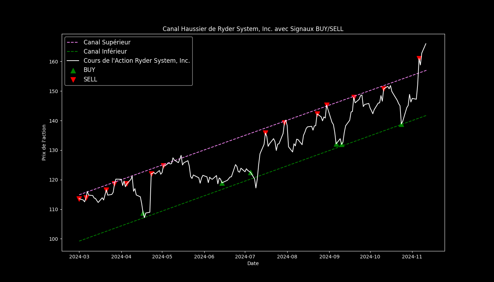

# canalascendant

"Modélisation en python d'un robot producteur de signaux sur une action en channel ascendant"

Objectifs : un robot de trading qui génère des signaux d'achat et de vente en utilisant Python.

